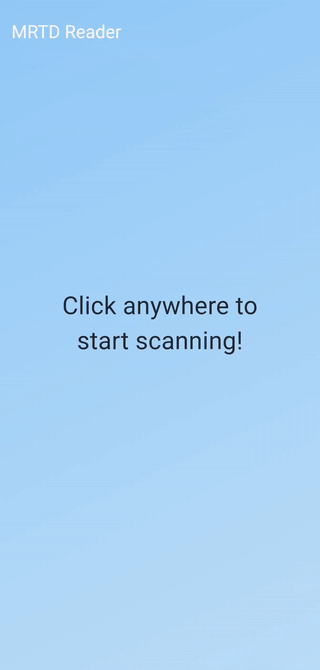

# MRTD NFC Reader

An app to read the Machine Readable Travel Document (MRTD) chip of an electronic using NFC.
The application follows the ICAO 9303 standard for the MRTD.

## How it works

- The date of expiry, date of birth and document number are read from the MRZ zone of the document which are needed for
  the authentication process. See the [MrzRecognizer](lib/src/components/ocr/mrz_recognizer.dart) class.
- The authentication is performed using the BAC (Basic Access Control) protocol.
- First the COM file is read to get all the available bytes then all the supported files are read. See
  the [MRTDInterface\.authenticate](lib/src/components/nfc/mrtd_interface.dart#L35) method.

## What works

- OCR of the MRZ zone (tough it's not perfect).
- BAC authentication and secure messaging.
- Read the files: COM, MRZ (DG1), Portrait (DG2), Additional Personal Details (DG11), Additional Document Details (
  DG12).

## Todo list

- [ ] Read more files.
- [ ] Validate the content of the MRTD.
- [ ] PACE authentication.
- [ ] Move TravelDocument models to a separate package.
- [ ] Move the NFC code to a separate package.
- [ ] Add more tests.

Contributions are welcome!

## Resources

- [ICAO 9303 - P11](https://www.icao.int/publications/Documents/9303_p11_cons_en.pdf) - Protocol used my the eMRTD chip.
- [ICAO 9303 - P4](https://www.icao.int/publications/Documents/9303_p4_cons_en.pdf) - Specification for the MRZ zone. 

## Credits
- [cie-nis-python-sdk](https://github.com/italia/cie-nis-python-sdk/tree/master): starting concept